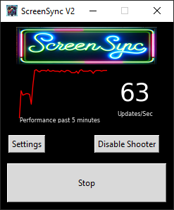
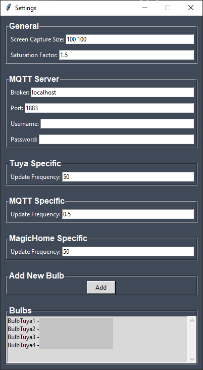

# Screen Sync

## About
Screen Sync is a Python application designed to synchronize the colors of your computer screen with various smart light bulbs, including Tuya WiFi bulbs. It captures the dominant colors from your screen and sets your smart bulbs to match these colors in real-time, enhancing your entertainment and work environment with ambient lighting.

[Video of ScreenSync v2 in action
](https://youtu.be/yRZ50QbaHPo)

## Features
- Real-time screen color synchronization.
- Support for multiple bulb types (Currently for Tuya WiFi bulbs and bulbs via Zigbee2MQTT).
- Customizable settings for color processing and bulb control.
- Per-bulb type refresh rate settings
- Multiple zone sampling
- User-friendly GUI for easy interaction.

## Installing

There are two ways to install ScreenSync - either via pypi / pip3 or via downloading a standalone executable for windows.

### Downloading Standalone

Go to the [releases](https://github.com/dewgenenny/ScreenSync_v2/releases/) page, there you can find a Windows executable that has been created using pyinstaller. Hopefully soon I'll also have time to share pre-built binaries for Mac. 

If you'd like to create the executable yourself, you can clone this repository then run the following command to create the executable:

`pyinstaller --onefile --windowed --icon=screensync/assets/ScreenSync.ico --name=ScreenSync --add-data="screensync/assets;screensync/assets" screensync/ui.py
`

### Installation via pip

For installing via pip, you can use the following command:

`pip3 install ScreenSync`

Once installed via pip, you can simply run with `ScreenSync` on the command line

### First Run 

On the first run, ScreenSync will create a config.ini in an appropriate directory (using the awesome platformdirs to figure out the right place).

Once open you can add bulbs via the settings page. 

#### Tuya Bulbs

To add your Tuya bulbs, you'll need a 'Device_ID' as well as a 'LocalKey' and an IP address of each bulb. 

If you don't already know the DeviceID and LocalKey, you can use the very awesome 'tinytuya' python module to discover bulbs and get their associated information.

You can find out more information and instructions here: [https://github.com/jasonacox/tinytuya](https://github.com/jasonacox/tinytuya) 

ScreenSync v2 uses the tinytuya library for communicating with Tuya bulbs, it's awesome!

#### Zigbee2MQTT based bulbs

For Zigbee2MQTT based bulbs, you just need to ensure that the MQTT server information is filled out completely as well as the information on a per bulb basis.

To add a Zigbee2MQTT based bulb, you just need to add the topic that the bulb is accessible via. Typically this would be something like `zigbee2mqtt/<friendly name>/set`. For example for my Garden Lights, it's `zigbee2mqtt/Garden_Lights/set`

#### MagicHome based bulbs

These bulbs just require knowing the IP address of the bulb / LED strip that you'd like to connect to.

## To-Dos

- Optimise MSS code to use multiprocessing // speed up sampling. We need to get to 50+ samples/sec as this seems to be what Tuya bulbs can handle
- Optimise latency Sample->Update
- Add ability to customise sampling
- Improve UI
- Add additional common bulb types 

